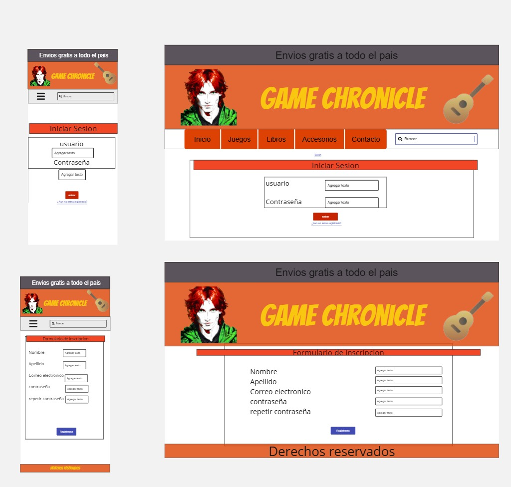
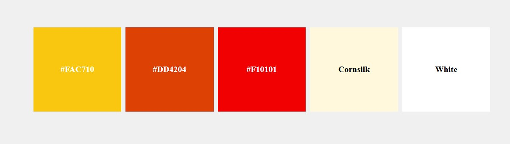

# Bienvenidos

---
##  Presentacion   **SPRINT 1**
Como primer desafio del curso de **Digital House** tenia que armar una estructura basica de un futuro proyecto a implementar   

🟩A continuacion les comparto el trello del desafio armado por el profesor encargado [Desafio digital house](https://trello.com/b/P20UN0sx/dpfsprintall)  

🟩 Y tomando como base el del profesor comparto el Trello personal que fui arreglando [Tablero propio](https://trello.com/b/k2kpoAcS/chronicle)  

---
## Tematica

Elegi como tematica una tienda de juegos de mesa, libros(incluyendo comics,mangas) y articulos de la cultura popular como un anillo del señor de los anillos o la varita de harry potter etc.
Las fuentes de referencia se caracterizan por dedicarse a vender juegos que no tienen un origen nacional son importados en su gran mayoria se  los conoce bajo la modalidad Eurogames son juegos que no tienen un camino lineal a la victoria permitiendo multiples formas de coronarse. A su vez varias de ellas venden libros y articulos de coleccion podriamos decirles.

Las fuentes de Referencia son las siguientes paginas: 

[🟢Abracadabra juguetes](https://www.abracadabrajuguetes.com.ar/)        [🟢Invictvs](https://invictvs.com.ar/tienda/?gad_source=1&gclid=Cj0KCQiAoae5BhCNARIsADVLzZc2Ar2lcGnmqvqMbP4j6ZdZEsbvlm8NUYmCB9mS8cvGldXsH1ko9pEaAmlZEALw_wcB)    [🟢cosmere Books](https://www.cosmerebooks.com.ar/?srsltid=AfmBOopy4uaz00TFQEg4oqdxFzC9DyjN9rfLDVHztEuEy0L926IzV4oW)  
  [🟢Dados en manos](https://www.dadosenmano.com.ar/juegos-de-mesa/?mpage=3)  [🟢Tienda educando](https://www.tienda.educando.com.ar/listado/juegos-juguetes/juegos-mesa-cartas/?srsltid=AfmBOorjrLIXJ8t1NiiP0ObbtZCW08CDdsYnJPE_nXJZH0vKi4quq7Eq)[🟢Magicclair](https://www.magiclair.com.ar/collections/boardgame-juegos-de-mesa)  
    [🟢Payana juegos](https://payanajuegos.com.ar/categoria-producto/juegos-de-mesa/componentes/artesanales/)   [🟢Tienda maldon](https://tienda.maldon.com.ar/todos-los-juegos/)     [🟢La revisteria](https://www.larevisteriacomics.com/?gad_source=1&gclid=Cj0KCQiAoae5BhCNARIsADVLzZcfM5b4eq5hcGeN1gX9B1BdF6nivr_xSZQfQ61bA8YCmWelNKj4boUaAngUEALw_wcB)  

    El sitio  por el contenido tiene predominancia de orientacion a ciertos sectores más juveniles, pero no deja de contener productos para el publico en general y de todas las edades.  

---
## Logo
Me inspire de un personaje que me gusta mucho de una saga de libros conocida como la Cronica del Asesino de reyes desarrolle varios bocetos en el camino con la ayuda de una IA y logre alterar un poco algunos detalles usando **[Canva](https://www.canva.com/)** y **[GIMP](http://www.gimp.org.es/)**. Al carecer de habilidad para el diseño grafico y no conocer como explotar el potencial de los softwares obtuve un resultado  que medianamente se acercaba a lo que queria. Dejo algunos bocetos debajo.
De este mismo personaje se origina el nombre de la tienda **GAME CHRONICLE**
El instrumento que acompaña al resultado final es un Laud. Muchos de los bocetos generados sentia que no representaban la esencia adecuada del personaje y no generaba un laud la IA
  
  

---
## wireframe
Realice un boceto del diseño aproximado de la secciones en general, Puede variar de la implementacion real y tambien puede que falten algunos diseños y elementos en los mismos.
     
>Diseño aproximado del index en mobiles  

   
>diseño del login  aproximado

   
>Diseño de productos y carrito de compras  

  

>Vista Mobile aproximada  

  
---
## Logos y tipografia
Estos colores son los que mas resaltan y se usan en el proyecto puede aparecer alguna tonalidad de gris o negro o colores muy suaves que combinen con el blanco

 Las tipografias predominantes en el proyecto son:  

font-family: "Bangers", system-ui;  

font-family: "Open Sans", sans-serif;

## Implementacion
Aunque el desafio no lo solicitaba... Por algunos malos entendidos ya tengo una version del index o Home avanzada(No deja de ser un trabajo en progreso y mejorable).  
>Utilice una combinacion de estructura grid con secciones manejadas con flex internamente  

Teniendo en cuenta que la mayoría de los sitios web mantienen una estructura común en muchas de sus secciones, como un encabezado (header), un banner, una barra de navegación y un pie de página (footer), cada sección conserva estos elementos, mientras que lo único que varía es el diseño del contenido principal.

**El resto de las secciones y los media queries no estan implementadas**

>Gran parte del index fue realizado con % y algunos rem sabiendo que es necesario un diseño responsivo a futuro.

## Producto
Pensando en otros aspectos cada articulo del sitio esta dentro de una clase tarjeta con imagen,descripcion, precio y un boton para añadir al carrito(implementacion futura).  

En este punto del curso desconozco como hacerlo, pero creo que cada tarjeta debe tener una serie de atributos para ser tratado como si fuera una instancia de la clase tarjeta y agregarles ciertas caracteristicas logicas como si hay unidades disponibles del producto, cuantas como numero entero, cada producto tiene un ID unico y a su vez si hay un login hay instancias de usuarios que deberian tener historiales de compra compuestos o agregados de tarjeta.   

