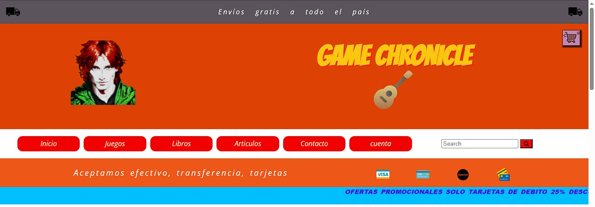

# Bienvenidos

---  

###  Presentacion   **SPRINT 3**
    
>A continuacion les comparto el trello del desafio que arme como guia para este sprint  [Desafio digital house]

###### A partir de este punto incursionaré en **Sprints 3 en adelante** con modificacion y reducciones en sprints siguientes a este por cuestiones de tiempo .  

El readme del sprint anterior lo deje disponible dentro de la carpeta de **'history readme'** como forma de tener seguimientos del proyecto ademas de poder verlo en el historial. No profundizaré demasiado en cosas ya mencionadas en el sprint anterior. Por ultimo tambien queda la retroalimentacion generada del sprint anterior. Sugiero leer ambas antes de venir aqui.    

---
Comparto la actualizacion del tablero trello el cual contiene las tarjetas del 2 y del 3 realizadas   
💽 **[Trello](https://trello.com/invite/b/67e84592e54bdb62f45af6cd/ATTI51fa3abe5934411cf9511f0008d84e63602D0594/proyecto-de-dh)**

#### Como supongo debe ser normal, siempre se ajustan nuevamente algunas cosas del html y/o css, pero comenzamos a implementar todas las vistas partiendo con los  partials  que generalmente son comunes a todas las secciones.

Luego de renderizar de forma generica en index.js todas las vistas Y crear algunas variables con objetos del tipo producto las cargamos a las vistas que lo requieran.

#### Finalmente separamos las renderizaciones hechas en index en el patron MVC e implementamos algunos de los metodos seguros se requieren otros en el futuro o modificaciones o mejorar de los ya hechos.

--- 
Debido a que saltamos gran parte del sprint 4 y 5 tenemos varias reformas que aplicar y corregir ademas de ir trabajando vistas de perfil,usuario y ABM de productos para los administradores
Creamos un modelo en drawio.io de entidad Relacion que fue mutando con el tiempo mientras se implementaba en mysql
Tomamos ideas del diagrama de clases y pensamos que producto es una clase abstracta y superclase de juegos,libros o articulos --> en la BDD va a existir pero solo con los atributos basicos y los especializados de cada clase lo tiene los hijos junto con una referencia FK a su padre.
Habia muchas relaciones muchos a muchos, algunas se implementaron y otras se penso como se podia evitar o rediseñar para no tener tantas tablas.  

--- 

## Modulos y paquetes instalados
1. instalamos node
2. instalamos express y express-session
3. instalamos los modulos para conectar con mysql 
4. instalamos sequelize
5. instalamos el modulo para cifrar contraseñas bcrypt
6. instalamos dotenv para ocultar las credenciales de acceso a la bdd
7. instalamos el motor de vistas ejs

---
## Tareas pendientes
1.  implementar el resto de procesos en las rutas y controladores 
>Gestinar el acceso a distintas rutas 
2.  aplicar modificaciones(y mejoraras) en las vistas y formularios para que los productos recibidos provengan de la bdd y no de objetos y variables literales cargados en el momento en js
3. cargar mas productos y usuarios 
4. implementar metodos para que lo traido de la base de datos se transforme y llegue como queremos a las vistas
5. Implementar formularios para la carga de Direcciones,Tarjetas y para la modificacion de datos de usuario.
6. crear funciones de busqueda para traer productos y pasarlos a las vistas
7. Agregar al boton añadir producto que guarde el producto en la session del user
8. Modificar tabla con las particularidades de cada producto
9. Realizar sprint de react sobre el carrito 

